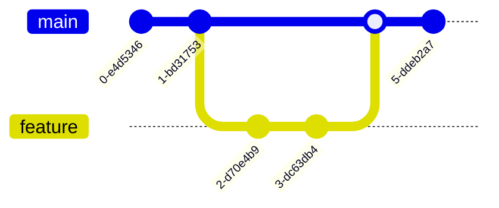

# Mermaid Diagrams in Slidev

This skill covers creating visual diagrams using Mermaid syntax in Slidev presentations. Mermaid allows you to create flowcharts, sequence diagrams, class diagrams, and many other diagram types using simple text.

## When to Use This Skill

- Creating flowcharts and process diagrams
- Showing system architecture
- Visualizing sequences and workflows
- Creating class and entity diagrams
- Building organizational charts
- Displaying timelines and Gantt charts

## Basic Syntax

Use a code block with `mermaid` language:

````markdown

````

## Flowcharts

### Top-Down Flow

````markdown

````

### Left-Right Flow

````markdown

````

### Node Shapes

````markdown

````

### Arrow Types

````markdown

````

## Sequence Diagrams

### Basic Sequence

````markdown

````

### With Activation

````markdown

````

### Notes and Loops

````markdown

````

## Class Diagrams

### Basic Class

````markdown

````

### Relationships

````markdown

````

## State Diagrams

````markdown

````

### Nested States

````markdown

````

## Entity Relationship Diagrams

````markdown

````

## Gantt Charts

````markdown

````

## Pie Charts

````markdown

````

## Git Graphs

````markdown

````

## Mind Maps

````markdown

````

## Timeline

````markdown

````

## Styling Diagrams

### Theme Option

````markdown

````

Available themes: `default`, `neutral`, `dark`, `forest`, `base`

### Scale Option

````markdown

````

### Combined Options

````markdown
```mermaid {theme: 'neutral', scale: 0.7}
graph LR
    A --> B --> C --> D
```
````

## Custom Styling

### Node Classes

````markdown
```mermaid
graph TD
    A[Important]:::important --> B[Normal]
    B --> C[Warning]:::warning

    classDef important fill:#f96,stroke:#333,stroke-width:2px
    classDef warning fill:#ff0,stroke:#333
```
````

### Link Styling

````markdown
```mermaid
graph LR
    A --> B
    B --> C
    linkStyle 0 stroke:#f00,stroke-width:2px
    linkStyle 1 stroke:#0f0,stroke-width:2px
```
````

## Configuration

### Global Mermaid Config

Create `setup/mermaid.ts`:

```typescript
import { defineMermaidSetup } from '@slidev/types'

export default defineMermaidSetup(() => {
  return {
    theme: 'neutral',
    themeVariables: {
      primaryColor: '#3b82f6',
      primaryTextColor: '#fff',
      primaryBorderColor: '#2563eb',
      lineColor: '#64748b',
      secondaryColor: '#f1f5f9',
    },
  }
})
```

## Best Practices

### 1. Keep Diagrams Simple

❌ **Too complex**
```
20+ nodes, crossing lines everywhere
```

✓ **Clear and focused**
```
5-10 nodes, logical flow
```

### 2. Use Meaningful Labels

❌ **Vague labels**
```mermaid
graph TD
    A --> B --> C
```

✓ **Descriptive labels**
```mermaid
graph TD
    Request[HTTP Request] --> Auth[Authentication]
    Auth --> Response[JSON Response]
```

### 3. Choose Right Diagram Type

| Content | Diagram Type |
|---------|--------------|
| Process flow | Flowchart |
| API calls | Sequence |
| Data models | Class/ER |
| Project timeline | Gantt |
| Distribution | Pie |
| Hierarchy | Mind map |

### 4. Consider Animation

Use v-click to reveal diagram parts:

````markdown
<v-click>

```mermaid
graph TD
    A --> B
```

</v-click>

<v-click>

```mermaid
graph TD
    A --> B --> C
```

</v-click>
````

## Common Patterns

### System Architecture

````markdown
```mermaid
graph TB
    subgraph Client
        UI[Web App]
        Mobile[Mobile App]
    end

    subgraph Backend
        API[API Gateway]
        Auth[Auth Service]
        Core[Core Service]
    end

    subgraph Data
        DB[(PostgreSQL)]
        Cache[(Redis)]
    end

    UI --> API
    Mobile --> API
    API --> Auth
    API --> Core
    Core --> DB
    Core --> Cache
```
````

### Request Flow

````markdown
```mermaid
sequenceDiagram
    actor User
    participant FE as Frontend
    participant BE as Backend
    participant DB as Database

    User->>FE: Click Button
    FE->>BE: POST /api/action
    BE->>DB: INSERT
    DB-->>BE: OK
    BE-->>FE: 201 Created
    FE-->>User: Success Toast
```
````

## Output Format

When creating diagrams:

```
DIAGRAM PURPOSE: [What it illustrates]
DIAGRAM TYPE: [flowchart/sequence/class/etc.]

```mermaid {[options]}
[diagram code]
```

KEY ELEMENTS:
- Node A: [represents...]
- Node B: [represents...]
- Arrow X->Y: [means...]

STYLING NOTES:
- Theme: [chosen theme]
- Scale: [if adjusted]
- Custom classes: [if any]
```
