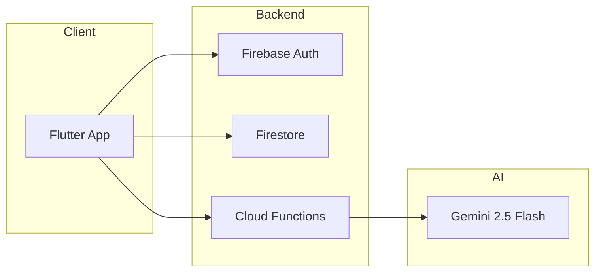

# open-ssyok-finance

> **KitaHack 2026 Entry** - Team Hokkien Mee is Red

A hyper-local, AI-powered financial companion for young Malaysians. Built with Flutter, Firebase, and Gemini AI.



## 📁 Project Structure

| Folder | Purpose | Status |
|--------|---------|--------|
| [`frontend/`](./frontend/) | Flutter mobile app | ⏳ Not Started |
| [`backend/`](./backend/) | Node.js + Firebase backend | ⏳ Not Started |
| [`slidev-pitch-deck/`](./slidev-pitch-deck/) | KitaHack pitch presentation | ⏳ Not Started |
| [`contexts/`](./contexts/) | Knowledge base & documentation | ✅ Complete |
| `ssyok-Finance/` | Legacy React Native app (reference) | 📦 Archived |

## 🛠️ Available Skills

| Skill | Purpose |
|-------|---------|
| `flutter-expert` | Flutter development patterns |
| `flutter-adaptive-ui` | Responsive layouts for all platforms |
| `flutter-animations` | Motion and transitions |
| `slidev` | Create Slidev presentations |
| `baoyu-slide-deck` | Generate slide images |
| `study-notes-creator` | Organize documentation |

## 🚀 Quick Start

```bash
# Frontend
cd frontend
flutter pub get
flutter run

# Backend
cd backend
npm install
npm run dev

# Slidev
cd slidev-pitch-deck
npm install
npm run dev
```

## 📚 Documentation

See [`contexts/`](./contexts/) for:
- **ssyok-finance/** - Reverse-engineered React Native app docs
- **kitahack-2026/** - Competition context, rubrics, pitch materials

## 🎯 KitaHack 2026 Goals

- [ ] Migrate core features from React Native to Flutter
- [ ] Implement Gemini AI "Finance Explainer" feature
- [ ] Build Firebase backend with auth & data sync
- [ ] Create compelling pitch deck for Demo Day

---
*Last Updated: 2026-02-04*