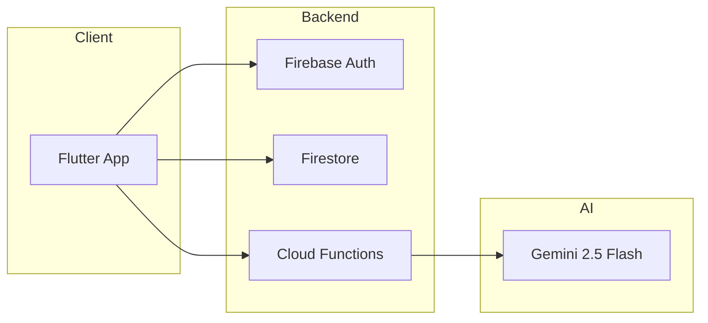
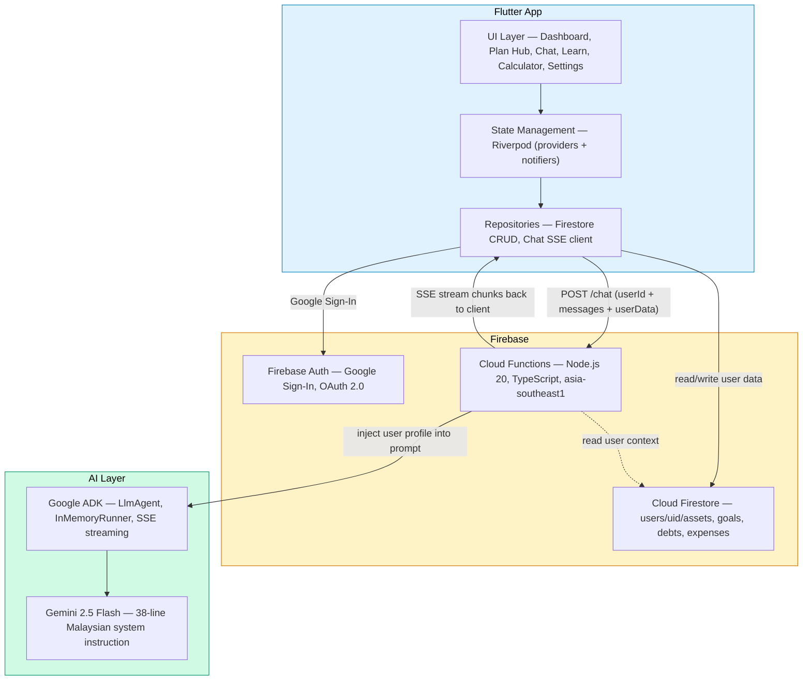
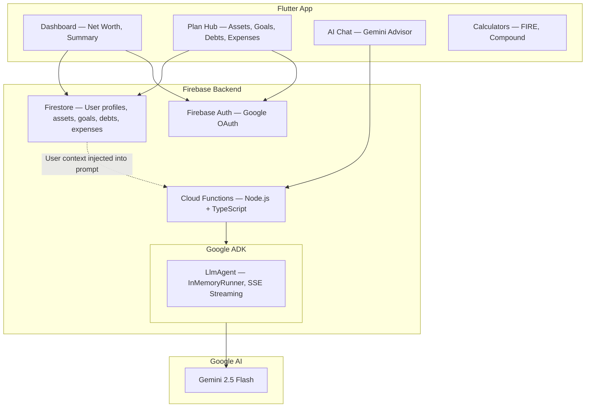

# Open ssyok Finance

> **KitaHack 2026 Entry** — Team Hokkien Mee is Red

A hyper-local, AI-powered financial companion for young Malaysians. Built with Flutter, Firebase, and Gemini AI.

**ssyok Finance** is the product. This is the **open-source** repository submitted for KitaHack 2026.


```mermaid
flowchart LR
    subgraph Client
        A[Flutter App]
    end
    subgraph Backend
        B[Firebase Auth]
        C[Firestore]
        D[Cloud Functions]
    end
    subgraph AI
        E[Gemini 2.5 Flash]
    end
    A --> B
    A --> C
    A --> D
    D --> E
```

## Project Structure

| Folder | Purpose | Status |
|--------|---------|--------|
| [`frontend/`](./frontend/) | Flutter mobile app | Built |
| [`backend/`](./backend/) | Cloud Functions + Gemini AI agent | Built |
| [`slidev-pitch-deck/`](./slidev-pitch-deck/) | KitaHack pitch presentation | In Progress |

## How It Works

The app has two parts that talk to each other:

```
┌─────────────────────────┐              ┌─────────────────────────────┐
│   Flutter App (frontend)│              │  Cloud Functions (backend)  │
│                         │              │                             │
│   Dashboard             │              │  POST /chat                 │
│   Plan Hub              │    HTTP      │    ↓                        │
│   Learn                 │  ─────────►  │  Google ADK (LlmAgent)      │
│   Calculator            │              │    ↓                        │
│   AI Chat               │  ◄─────────  │  Gemini 2.5 Flash           │
│                         │    SSE       │    ↓                        │
│                         │  (streaming) │  Streams response back      │
└────────────┬────────────┘              └──────────────┬──────────────┘
             │                                          │
             │         ┌────────────────────┐           │
             │         │  Firebase (shared) │           │
             ├────────►│                    │◄──────────┘
             │         │  Auth (Google SSO) │
             │         │  Firestore (data)  │
             │         └────────────────────┘
             │
     Gemini API key NEVER
     reaches the client
```

- **Frontend** (`frontend/`) — Flutter app that handles all UI, stores user data in Firestore, and sends chat messages to the backend
- **Backend** (`backend/`) — a single Cloud Function (`POST /chat`) that receives the user's financial profile + question, passes it to Gemini via Google ADK, and streams the AI response back
- **Firebase** — ties them together: Auth for Google Sign-In, Firestore for user data, Cloud Functions for hosting the backend
- **Gemini API key** — lives on the server only, stored as a Firebase secret, never exposed to the app

## Prerequisites

| Tool | Version | Install |
|------|---------|---------|
| Flutter | 3+ | [flutter.dev/get-started](https://docs.flutter.dev/get-started/install) |
| Node.js | 20+ | [nodejs.org](https://nodejs.org/) |
| Firebase CLI | latest | `npm install -g firebase-tools` |
| Gemini API key | free | [aistudio.google.com/app/apikey](https://aistudio.google.com/app/apikey) |

You also need an Android device/emulator or iOS simulator to run the Flutter app.

## Getting Started

### Step 1: Clone and install dependencies

```bash
git clone https://github.com/open-ssyok/finance.git
cd finance
make install
```

This runs `flutter pub get` in `frontend/` and `npm install` in `backend/`.

### Step 2: Get a Gemini API key

The AI chat feature needs a Gemini API key. It's free:

1. Go to [Google AI Studio](https://aistudio.google.com/app/apikey)
2. Click **Create API Key**
3. Copy the key

Then create the config file:

```bash
cp backend/.env.template backend/.env.local
```

Open `backend/.env.local` and paste your key:

```env
GEMINI_API_KEY=AIzaSy...your-key-here
```

> This file is gitignored. Your key stays local and is never committed.

### Step 3: Set up Firebase (only if you want live Auth/Firestore)

**For local development with the emulator, you can skip this step.** The Firebase emulator runs without a real project.

If you want Google Sign-In and real Firestore data:

```bash
firebase login                       # Log in to your Google account
firebase use smart-bloom-350004      # Already set in .firebaserc
```

<details>
<summary><strong>Want to use your own Firebase project instead?</strong></summary>

1. Create a project at [console.firebase.google.com](https://console.firebase.google.com)
2. Enable **Authentication** (Google Sign-In) and **Firestore** in the console
3. Run:
   ```bash
   firebase use your-project-id
   cd frontend && flutterfire configure
   ```
   This regenerates `firebase_options.dart` and `google-services.json` for your project.
4. Update the default backend URL in `frontend/lib/features/chat/data/chat_repository.dart` to match your project ID.

</details>

### Step 4: Run the app

**Option A** — Run both frontend and backend together:

```bash
make dev
```

**Option B** — Run them in separate terminals (easier to see logs):

```bash
# Terminal 1: Start the backend (Firebase emulator)
make backend-dev
# This starts the Cloud Functions emulator at http://localhost:5001

# Terminal 2: Start the Flutter app
make frontend-run
# Pick your device when prompted
```

The Flutter app automatically connects to the local backend emulator. No extra config needed.

### Step 5: Test the AI chat

1. Sign in (or skip if using emulator without Auth)
2. Go to **Settings > Load Demo Data** to populate sample Malaysian financial data
3. Tap the **AI button** (center of bottom nav) to open the chat
4. Try a suggested prompt like "Analyze my net worth"

The backend will call Gemini and stream the response back in real-time.

### Step 6: Deploy to production (optional)

```bash
# One-time: store your Gemini key as a Firebase secret
firebase functions:secrets:set GEMINI_API_KEY

# Deploy the Cloud Function
make backend-deploy
```

To make the Flutter app talk to the deployed backend instead of the local emulator:

```bash
make frontend-run ARGS='--dart-define=BACKEND_URL=https://asia-southeast1-smart-bloom-350004.cloudfunctions.net'
```

## All Make Targets

| Target | What it does |
|--------|-------------|
| **Shortcuts** | |
| `make install` | Install all dependencies (frontend + backend + slidev) |
| `make dev` | Run backend emulator + Flutter app in parallel |
| `make help` | Print all available targets |
| **Frontend** | |
| `make frontend-get` | `flutter pub get` |
| `make frontend-run` | `flutter run` |
| `make frontend-build` | `flutter build apk` |
| `make frontend-test` | `flutter test` |
| **Backend** | |
| `make backend-install` | `npm install` in `backend/` |
| `make backend-dev` | Start Firebase emulator (Cloud Functions only) |
| `make backend-deploy` | Build TypeScript + deploy to Firebase |
| `make backend-logs` | View Cloud Functions logs |
| **Pitch Deck** | |
| `make slidev-install` | `npm install` in `slidev-pitch-deck/` |
| `make slidev-dev` | Start Slidev dev server at localhost:3030 |
| `make slidev-build` | Build Slidev for production |

## Google Technologies Used

| Technology | What it does in ssyok Finance |
|------------|------|
| **Flutter** | The entire mobile app — UI, navigation, state management (Riverpod), Material 3 design |
| **Firebase Auth** | Google Sign-In — users tap one button to log in, no passwords needed |
| **Cloud Firestore** | Stores all user data (assets, debts, goals, expenses) with real-time sync and per-user security rules |
| **Cloud Functions** | Hosts the backend — a single `/chat` endpoint that receives user data, calls Gemini, and streams the response |
| **Google ADK** | Agent framework (`@google/adk`) — wraps Gemini in an `LlmAgent` with session management and SSE streaming |
| **Gemini 2.5 Flash** | The AI brain — reads the user's full financial profile and generates personalized Malaysian financial advice |

---

## Prototype Documentation

### Technical Architecture


```mermaid
flowchart TB
    subgraph Client["Flutter App"]
        direction TB
        UI["UI Layer — Dashboard, Plan Hub, Chat, Learn, Calculator, Settings"]
        State["State Management — Riverpod (providers + notifiers)"]
        Repo["Repositories — Firestore CRUD, Chat SSE client"]
        UI --> State --> Repo
    end

    subgraph Firebase["Firebase"]
        Auth["Firebase Auth — Google Sign-In, OAuth 2.0"]
        FS["Cloud Firestore — users/uid/assets, goals, debts, expenses"]
        CF["Cloud Functions — Node.js 20, TypeScript, asia-southeast1"]
    end

    subgraph AI["AI Layer"]
        ADK["Google ADK — LlmAgent, InMemoryRunner, SSE streaming"]
        Gemini["Gemini 2.5 Flash — 38-line Malaysian system instruction"]
        ADK --> Gemini
    end

    Repo -- "read/write user data" --> FS
    Repo -- "Google Sign-In" --> Auth
    Repo -- "POST /chat (userId + messages + userData)" --> CF
    CF -- "inject user profile into prompt" --> ADK
    CF -. "read user context" .-> FS
    CF -- "SSE stream chunks back to client" --> Repo

    style Client fill:#e0f2fe,stroke:#0284c7,color:#000
    style Firebase fill:#fef3c7,stroke:#d97706,color:#000
    style AI fill:#d1fae5,stroke:#059669,color:#000
```

**Frontend** — Flutter 3+ with feature-based architecture:
```
frontend/lib/
├── app/                    # Router (GoRouter), theme (Material 3), animations
├── features/
│   ├── auth/               # Google Sign-In via Firebase Auth
│   ├── onboarding/         # 3-step profile setup (name, age, user type)
│   ├── dashboard/          # Net worth card, quick actions, summary cards
│   ├── plan/               # Assets, goals, debts, expenses, safety net
│   ├── chat/               # Gemini AI chat with SSE streaming
│   ├── learn/              # Financial articles (markdown content)
│   ├── calculator/         # Compound interest & FIRE calculators
│   └── settings/           # Profile edit, demo data loader, reset
├── core/                   # Services (local storage, Firestore)
└── shared/                 # Reusable widgets (Pressable, AnimatedListItem)
```

**Backend** — a single Cloud Function that proxies to Gemini:
```
backend/src/
├── index.ts        # POST /chat endpoint — validates request, sets SSE headers, streams response
├── agent.ts        # Google ADK LlmAgent — 38-line Malaysian system instruction, builds prompt
│                   #   with user's full financial profile + conversation history
└── types.ts        # TypeScript interfaces — ChatMessage, UserData, Asset, Debt, Goal, Expense
```

**Data flow for AI chat:**
1. User types a question (or taps "Chat about this" on any metric)
2. Flutter gathers the user's full financial profile from Firestore
3. `POST /chat` sends `{ userId, messages[], userData }` to Cloud Functions
4. Cloud Function builds a prompt: system instruction + financial profile + history + question
5. Google ADK `LlmAgent` passes it to Gemini 2.5 Flash
6. Gemini streams tokens back via SSE → Cloud Function relays chunks → Flutter renders in real-time

### Implementation Details

**Key design decisions:**

| Decision | What we did | Why |
|----------|------------|-----|
| Server-side AI | Gemini runs in Cloud Functions, not in the Flutter app | API key security — key is a Firebase secret, never in the client bundle |
| Google ADK | Used `LlmAgent` + `InMemoryRunner` instead of raw Gemini API calls | Agent orchestration, session management, built-in SSE streaming |
| Stateless sessions | Each chat request creates a fresh ADK session; history replayed in prompt | Cloud Functions are stateless — keeps architecture simple and scalable |
| Malaysian system prompt | 38 lines referencing EPF, PTPTN, ASB, Tabung Haji, mamak budgets, Manglish tone | Generic Gemini responses felt "foreign" — testers wanted local context |
| Feature-based architecture | `lib/features/{feature}/presentation/`, `domain/`, `data/` | Each feature is self-contained; easy to add new modules |
| Riverpod state management | `StateNotifier` + `FutureProvider` pattern | Immutable state, async-first, testable — preferred over Provider/Bloc for this scale |
| SSE streaming | Response streamed token-by-token from Gemini → Cloud Functions → Flutter | Users see the AI "typing" in real-time instead of waiting for full response |

### Challenges Faced

**Challenge 1: Making Gemini sound Malaysian, not generic**

Initial Gemini responses gave advice like "Consider diversifying your portfolio" — technically correct but culturally tone-deaf. Testers said it felt like "talking to a foreign advisor."

We iterated through 3 approaches:
1. Simple prefix ("You are a Malaysian advisor") — marginal improvement
2. Added Malaysian instrument names (EPF, PTPTN) — better but still formal
3. Built a 38-line system instruction with specific rates (EPF 11%+12%, ASB 4-7%, PTPTN 1%), local cost references (mamak meals, LRT fares), and personality ("knowledgeable kawan") — this worked

**Challenge 2: Preventing flash-to-onboarding on app restart**

After sign-in, the router would briefly flash the onboarding screen before redirecting to dashboard. The fix: store `onboarding_complete` in SharedPreferences via `LocalStorageService`, and make the router wait for **both** `authStateProvider` and `localStorageServiceProvider` before any redirect.

**Challenge 3: Conversation history in stateless Cloud Functions**

Cloud Functions don't persist state between requests, so each request creates a fresh ADK session. We solve this by replaying the full conversation history (formatted as "You said / ssyok AI said") inside the prompt, along with the user's complete financial profile. Trade-off: longer conversations use more tokens, but for our typical 3-5 exchange sessions, it works well.

### Future Roadmap

```
2026                    2027                     2028-2029
 │                       │                         │
 ├─ Launch on Play Store ├─ Multi-language         ├─ ASEAN expansion
 │  (Android)            │  (BM, Mandarin)         │  (Indonesia, Philippines)
 │                       │                         │
 ├─ 100K users target    ├─ Insurance module       ├─ Financial Health Score
 │                       │  (AI-recommended        │  (longitudinal tracking)
 ├─ University campus    │   coverage)             │
 │  ambassador program   │                         ├─ Government partnerships
 │                       ├─ Employer B2B           │  (BNM financial literacy)
 ├─ Premium tier         │  (financial wellness    │
 │  ssyok+ AI            │   employee benefit)     ├─ Open Banking API
 │  (RM 4.90/month)      │                         │  (auto-import transactions)
 │                       ├─ Multi-region deploy    │
 └─ Firebase Analytics   │  (Singapore + Jakarta)  └─ Vertex AI upgrade
    event tracking       │                           (provisioned throughput)
                         └─ Caching layer
                            (reduce API costs ~30%)
```

**Near-term (2026):**
- Launch Android app on Google Play Store
- Premium subscription (ssyok+ AI at RM 4.90/month) for unlimited Gemini chat
- University partnerships across Malaysian campuses
- Firebase Analytics for usage tracking + Crashlytics for stability

**Mid-term (2027):**
- Bahasa Malaysia and Mandarin support via Gemini's multilingual capabilities
- Insurance recommendation module addressing SDG 8.10's "access to insurance" mandate
- Employer B2B partnerships — offer ssyok Finance as employee financial wellness benefit
- Malaysian Open Banking API integration (when framework matures)

**Long-term (2028-2029):**
- Expand to Indonesia, Philippines, and Thailand — same problem (low financial literacy + high smartphone penetration) across ASEAN
- Locale-specific `LlmAgent` instances with local instruments (BPJS for Indonesia, SSS for Philippines)
- Gemini-powered Financial Health Score with longitudinal tracking
- Government partnerships to support national financial literacy programs

---

## KitaHack 2026 Submission

### CATEGORY A: IMPACT (60 Points)

#### Problem Statement & SDG Alignment (15 Points)

<details>
<summary><strong>What real-world problem is your project solving?</strong></summary>

Young Malaysians are **functionally financially excluded**. They have access to financial services but lack the literacy to use them effectively.

The numbers paint a dire picture: **96% of Malaysians have a bank account** (BNM), yet only **39% meet the OECD's minimum financial literacy target** (OECD/INFE 2023). The consequence is devastating. Over **50,000 youths aged 30 and below are trapped in a debt spiral**, collectively owing **RM 1.9 billion** (AKPK April 2024). In 2024 alone, **877 youth bankruptcy cases** were recorded (Malaysia Insolvency Department), and **50% of Malaysians cannot survive 3 months without income** (BNM 2024).

The core problem is this: **giving someone a bank account without financial education is like giving them a car without teaching them to drive.** Existing solutions fail because generic expense tracking apps (like Money Lover or Spendee) are foreign context, boring, and provide no guidance. Bank apps (MAE, CIMB Clicks) are corporate, intimidating, and focused on selling products. Professional Certified Financial Planners (CFPs) cost **RM 200 to 500 per hour**, making them inaccessible to youth. And the only youth friendly fintech, **Raiz Malaysia**, exited the Malaysian market in September 2024, leaving users stranded.

ssyok Finance solves this by being a **free, AI powered Virtual Certified Financial Planner** that provides the same quality of personalized financial guidance that a human CFP offers, but accessible 24/7, in plain language young Malaysians understand, with hyper local context (EPF, PTPTN, Mamak budgets, RM denominated advice).

</details>

<details>
<summary><strong>Describe the UN Sustainable Development goal(s) and target(s) chosen for your solution.</strong></summary>

**SDG 8: Decent Work and Economic Growth**

**Target 8.10**: "Strengthen the capacity of domestic financial institutions to encourage and expand **access to banking, insurance and financial services for all**."

</details>

<details>
<summary><strong>How does the problem relate to your chosen SDG target(s)?</strong></summary>

SDG 8 Target 8.10 calls for expanding "access to financial services for all." In Malaysia, **access** is not the problem. 96% have bank accounts and 88% use e-wallets. The real gap is **understanding**. Financial access without financial literacy creates a paradox: people have the tools but don't know how to use them effectively.

The data validates this directly:

- **MYFLIC Index 2024**: Malaysia's financial literacy index is 59.1/100 (BNM Financial Capability & Inclusion Survey 2024), with only 39% meeting the OECD minimum target.
- **Youth Debt Crisis**: 50,000+ youths under 30 owe RM 1.9B (AKPK April 2024). The primary cause is personal loans at 46.4% (Insolvency Department 2024).
- **Bankruptcies**: 5,272 youth bankruptcies recorded between 2020 and 2025, with 877 in 2024 alone.
- **No Resilience**: 50% of Malaysians cannot survive 3 months without income (BNM 2024). 55.6% of Debt Management Programme enrollees are aged 20 to 39 (AKPK 2022).

ssyok Finance directly addresses Target 8.10 by transforming "access" from merely having accounts to **genuinely understanding and using financial services effectively**. The app makes AI guided financial planning free and accessible, ensuring the target's "for all" mandate is met, particularly for youth who are currently falling through the gap between access and understanding.

</details>

---

#### User Feedback & Iteration (15 Points)

<details>
<summary><strong>How did you validate your solution with real users?</strong></summary>

We recruited **university students**, our exact target demographic (Gen Z, ages 18 to 25), for hands-on testing sessions. Testers were **not teammates**; they were peers from our university who had no prior involvement in the project.

**Testing process:**
1. Each tester was given the Flutter app prototype and asked to complete a "Happy Path": sign in, enter sample financial data (assets, debts, expenses, goals), explore the dashboard, and interact with the Gemini AI chat feature.
2. After testing, we collected feedback through **verbal debriefs and written notes** focusing on three areas: usability, AI response quality, and feature value.
3. We specifically asked: *"What confused you?"*, *"What was the most useful part?"*, and *"Would you use this daily?"*

This was a qualitative validation approach focused on uncovering pain points and validating core value, appropriate for a prototype stage product.

</details>

<details>
<summary><strong>Share three key insights from user feedback.</strong></summary>

**Insight 1: AI responses felt too generic (Surprise)**
Users expected the AI to "sound Malaysian" but initial Gemini responses read like generic ChatGPT advice such as "Save 20% of your income" without any local context. This surprised us because we assumed Gemini would naturally adapt. Users said it felt "like talking to a foreign advisor who doesn't understand Malaysia."

**Insight 2: Dashboard numbers were confusing without explanation (Struggle)**
Users could see their net worth and emergency fund status but didn't understand what the numbers *meant*. For example, showing "Emergency Fund: 3.2 months" caused confusion. Users asked, "Is that good or bad? What should I aim for?" The raw data without context was creating the same problem we were trying to solve.

**Insight 3: The "Chat about this" concept was the most valuable (Value)**
When we prototyped a button that lets users tap any metric and ask Gemini to explain it, testers unanimously said this was the feature that made ssyok Finance different from other apps. One tester said: "This is like having a financial advisor sitting next to me while I look at my own data." The contextual, just-in-time education was the strongest value proposition.

</details>

<details>
<summary><strong>What three changes did you make based on user input?</strong></summary>

**Change 1: Malaysian Context in Every Prompt**
- **Feedback**: "The AI sounds like a foreign advisor, not Malaysian."
- **What we modified**: We rewrote the entire system instruction for our Gemini agent to include Malaysian specific financial references, including EPF contribution rules, ASB guaranteed returns, PTPTN 1% service charge, Tabung Haji, mamak meal budgets, LRT/MRT commute costs, and RM denominated examples. The AI now responds with phrasing like "Boss, your Kopi ais is cutting into your House fund" instead of generic advice.
- **Result**: Testers in follow-up sessions described the AI as "feeling like a knowledgeable kawan (friend)," which was exactly our target persona.

**Change 2: "Chat About This" Shortcut on Every Dashboard Metric**
- **Feedback**: "I see numbers but I don't know what they mean."
- **What we modified**: We added a "Chat about this" button to every summary card on the Dashboard and Plan Hub screens. Tapping it opens the AI Chat with a pre-filled prompt template that includes the user's relevant data, so Gemini immediately explains the specific metric in context.
- **Result**: Users no longer stare at numbers in confusion. Every number on the dashboard is now one tap away from a personalized AI explanation.

**Change 3: Pre-filled Prompt Suggestions on Chat Screen**
- **Feedback**: "I opened the AI chat but didn't know what to ask."
- **What we modified**: We added 5 suggested prompt buttons on the empty chat screen: "Analyze my net worth," "Review my goals," "Help with my debts," "Check my expenses," and "General financial advice." Each button triggers a PromptTemplate that builds a context-rich query with the user's actual data.
- **Result**: Users now engage with the AI immediately instead of staring at a blank chat. Engagement with the chat feature improved significantly during follow-up sessions.

</details>

---

#### Success Metrics (10 Points)

<details>
<summary><strong>How do you measure your solution's success?</strong></summary>

**Metric 1: Active Users & Engagement**
- **Month 3 target**: 1,000 active users with at least 3 chat interactions each
- **Month 6 target**: 10,000 active users, 500 paid ssyok+ AI subscribers
- **Year 1 target**: 100,000 users, targeting fresh graduates and underserved youth with zero access to professional financial advice
- **Measurement**: Daily Active Users (DAU), monthly chat interactions per user, session duration

**Metric 2: Financial Planning Adoption**
- Percentage of users who go beyond passive tracking to actively use planning features (goal setting, AI chat, "Chat about this")
- Target: **60% of active users** create at least one financial goal AND interact with the AI advisor within their first week
- **Measurement**: Firestore event tracking (`goal_created`, `chat_about_this_tapped`, `gemini_chat_sent`)

**Metric 3: Financial Goal Achievement Rate**
- Percentage of users who set a financial goal in the app and reach at least 50% progress within 6 months
- Target: **40% goal progression rate** among active users
- **Measurement**: Firestore goal tracking data (currentAmount / targetAmount over time)

These metrics collectively validate that ssyok Finance is being used as a **financial planner**, not just a passive tracker.

</details>

<details>
<summary><strong>What Google technologies power your analytics?</strong></summary>

- **Firebase Analytics**: Core event tracking for screen views, feature usage, chat interactions, and goal creation/completion events. Custom events include `gemini_chat_sent`, `goal_created`, `prompt_template_used`, and `chat_about_this_tapped`.
- **Firebase Crashlytics**: App stability monitoring and crash-free session rate tracking.
- **Firestore**: All user financial data (assets, debts, goals, expenses) is stored in Firestore, enabling us to compute aggregate analytics like average net worth, goal achievement rates, and most used features.
- **Google Cloud Functions Logs**: Backend request monitoring including Gemini API response times, token usage, and error rates.

Currently, as a prototype, we are collecting **structural data** through Firestore (user profiles, financial entries, chat messages). Firebase Analytics event tracking is configured and ready to capture usage patterns once we scale beyond prototype testing. The expected cause and effect: as users engage more with the "Chat about this" feature (measured via `chat_about_this_tapped` events), we expect higher goal progression rates (measurable via Firestore goal data), validating that AI guided understanding drives better financial behavior.

</details>

---

#### AI Integration (20 Points)

<details>
<summary><strong>Which Google AI technology did you implement?</strong></summary>

1. **Gemini 2.5 Flash**: Our core AI reasoning engine. Chosen for its speed (low latency for chat), cost efficiency, and strong reasoning capabilities for financial advice generation.

2. **Google Agent Development Kit (ADK)**: The `@google/adk` TypeScript SDK. We use `LlmAgent` with `InMemoryRunner` to manage the AI agent lifecycle. ADK provides agent orchestration, session management, and built-in streaming support (SSE mode).

3. **Google GenAI SDK**: The `@google/genai` package for content creation utilities (`createUserContent`) used within our ADK pipeline.

4. **Firebase Cloud Functions**: Server-side execution environment for the AI agent. All Gemini calls are made server-side to secure the API key and allow heavier prompt engineering logic.

**No non-Google AI is used.** The entire AI pipeline is Google-native.

</details>

<details>
<summary><strong>How does AI make your solution smarter?</strong></summary>

AI is not a feature of ssyok Finance. **AI IS ssyok Finance.** Without Gemini, the app would be just another static expense tracker. Here's what AI enables:

**1. Personalized Financial Advice (Core Feature):**
The AI receives the user's full financial profile including assets (savings, investments, property), debts (PTPTN, credit cards, car loans), expenses by category, and goals. It then generates specific, actionable advice. Example: Instead of generic "save more money," Gemini says: *"Your PTPTN has a 1% service charge but your credit card charges 18% interest. Prioritize the credit card because you're losing RM 200/month in interest alone. Redirect your RM 500 monthly savings toward the credit card first."*

**2. Contextual Explainers ("Chat About This"):**
Every metric on the dashboard is linked to a pre-built prompt template. When a user taps "Chat about this" on their net worth card, Gemini receives their full financial context and explains: *"Your net worth is RM 45,000. That's your RM 75,000 in assets minus RM 30,000 in debts. Your emergency fund covers 3.2 months. For a proper safety net, you need RM 5,600 more. At RM 500/month, target: October 2026."*

**3. Personal Inflation Rate Calculation:**
The AI uses the user's expense category breakdown (food, housing, transport, healthcare, education) and applies category-specific inflation rates to calculate a **personal inflation rate** instead of relying on the government's average CPI. A young parent spending 40% on medical gets a 5.1% personal inflation rate vs. the national 3%.

</details>

<details>
<summary><strong>What would your solution lose without AI?</strong></summary>

If AI were removed, ssyok Finance would become a **basic static calculator with no guidance**, fundamentally the same as the apps we're trying to replace. Specifically:

- **The "Chat about this" feature would break entirely.** Users would see numbers (net worth: RM 45,000) but have no explanation of what they mean, how to improve them, or what to prioritize. This is the exact problem we identified: access without understanding.
- **Personalized financial advice would disappear.** The app could show "Emergency Fund: 3.2 months" but couldn't say "You need RM 5,600 more, at RM 500/month that's October 2026." Users would be back to guessing.
- **The Personal Inflation Rate would become a static formula** without the AI's ability to contextualize it. Instead of "Your inflation is 5.1% because of your medical spending, so adjust your house deposit goal timeline accordingly," users would just see a number.
- **The Malaysian context advice would vanish.** Without Gemini's system prompt tuned with EPF/PTPTN/ASB references, users lose the "kawan" (friend) experience that makes ssyok feel local, not foreign.

In short: without AI, ssyok Finance becomes **yet another generic expense tracker**, exactly what we set out to replace.

</details>

---

#### Technology Innovation (10 Points)

<details>
<summary><strong>What makes your approach unique?</strong></summary>

**1. Personal Inflation Rate (No Other App Does This):**
Every financial planning app uses the government's CPI (currently ~3%) for inflation projections. But CPI is an *average*. A student spending 40% on food has different inflation than a retiree spending 40% on healthcare. ssyok Finance calculates a **personal inflation rate** based on the user's actual expense categories and their category-specific inflation rates. This means financial goals are based on *your* reality, not national averages.

**2. Virtual CFP Model (Not a Chatbot):**
We don't position our AI as a "chatbot." It's a **Virtual Certified Financial Planner** that delivers the same quality of advice that costs RM 200 to 500 per hour from a human CFP, but free and available 24/7. The AI has the user's full financial profile context, so every response is personalized advice, not generic tips.

**3. Hyper-Local Malaysian Context:**
Our system prompt is engineered with Malaysian-specific financial instruments (EPF, PTPTN, ASB, Tabung Haji, PRS), local cost of living references (mamak meals, LRT/MRT, rental benchmarks), and Manglish tone. The AI doesn't just speak English. It speaks *Malaysian*.

**4. Contextual Learning at Point of Need:**
Instead of a separate "education" section (which users ignore), learning happens when it's relevant. Confused by a number? Tap "Chat about this." The AI teaches you the concept *using your own data*.

</details>

<details>
<summary><strong>What's the growth potential?</strong></summary>

**Year 1 (2026-2027):**
- 100,000 users, targeting fresh graduates and underserved youth
- Launch on Google Play Store with premium ssyok+ AI subscription
- University partnership program across Malaysian campuses

**Year 2 (2027-2028):**
- **Multi-language support** including Bahasa Malaysia and Mandarin (via Gemini's multilingual capabilities), expanding reach to non-English speaking Malaysians
- **Insurance module expansion** with AI-recommended coverage based on user profile, addressing the "access to insurance" part of SDG 8.10
- **Employer partnerships** to offer ssyok Finance as a financial wellness benefit for company employees (B2B2C model)
- Integration with **Malaysian Open Banking APIs** (when available) for real transaction data import

**Year 3 (2028-2029):**
- **Southeast Asian expansion** to adapt for Indonesia (GoPay integration), Philippines, and Thailand, since the same problem (low financial literacy, high smartphone penetration) exists across ASEAN
- **Advanced AI features** including a Gemini-powered "Financial Health Score" with longitudinal tracking
- **Government partnerships** to position ssyok Finance as a tool for national financial literacy programs aligned with BNM's Financial Inclusion Strategy

</details>

---

### CATEGORY B: TECHNOLOGY (20 Points)

#### Technical Architecture (5 Points)

<details>
<summary><strong>Which Google Developer Technologies did you use and why?</strong></summary>

| Technology | Why We Chose It |
|------------|-----------------|
| **Flutter** | Cross-platform UI framework with a single codebase for Android, iOS, and web. Chosen over React Native for KitaHack Google Tech alignment and superior performance. Material 3 widgets match modern design standards. |
| **Firebase Auth** | Google Sign-In integration with zero custom auth code. Provides secure OAuth 2.0 tokens validated server-side. Chosen over custom JWT because it is faster to implement, more secure, and it's a Google service. |
| **Cloud Firestore** | Real-time NoSQL database with offline persistence. User financial data (assets, goals, debts, expenses) syncs instantly. Security rules enforce per-user data isolation (`users/{uid}/**`). Chosen over PostgreSQL because it is serverless, scales automatically, and requires no infrastructure management. |
| **Cloud Functions for Firebase** | Serverless Node.js backend for the AI agent. Handles API key security (Gemini key never exposed to client), prompt engineering logic, and SSE streaming. Chosen over Cloud Run for simpler deployment and tighter Firebase integration. |
| **Google ADK** | Agent Development Kit (`@google/adk`) for agent orchestration. Provides `LlmAgent`, `InMemoryRunner`, and built-in streaming (`StreamingMode.SSE`). Chosen because it's the official Google framework for building AI agents, demonstrating deep Google AI integration beyond a simple API call. |
| **Gemini 2.5 Flash** | AI reasoning engine. Chosen for speed (low latency chat), cost efficiency, and strong reasoning over structured financial data. Flash model balances quality and response time for real-time chat UX. |

</details>

<details>
<summary><strong>Briefly go through your solution architecture.</strong></summary>


```mermaid
flowchart TB
    subgraph Client["Flutter App"]
        direction LR
        Dashboard["Dashboard — Net Worth, Summary"]
        PlanHub["Plan Hub — Assets, Goals, Debts, Expenses"]
        AIChat["AI Chat — Gemini Advisor"]
        Calculators["Calculators — FIRE, Compound"]
    end

    subgraph Firebase["Firebase Backend"]
        Auth["Firebase Auth — Google OAuth"]
        Firestore["Firestore — User profiles, assets, goals, debts, expenses"]
        CloudFn["Cloud Functions — Node.js + TypeScript"]
        subgraph Agent["Google ADK"]
            LlmAgent["LlmAgent — InMemoryRunner, SSE Streaming"]
        end
    end

    subgraph AI["Google AI"]
        Gemini["Gemini 2.5 Flash"]
    end

    Dashboard & PlanHub --> Firestore
    Dashboard & PlanHub --> Auth
    AIChat --> CloudFn
    CloudFn --> Agent
    Agent --> Gemini
    Firestore -.->|"User context injected into prompt"| CloudFn
```

**How components connect:**

1. **Flutter App** handles all UI and local state management (Riverpod). It never directly calls the Gemini API.
2. **Firebase Auth** authenticates users via Google Sign-In. The resulting ID token is sent with every API call for server-side verification.
3. **Firestore** stores all user data in a per-user document structure (`users/{uid}/assets`, `goals`, `debts`, `expenses`). Security rules ensure users can only read/write their own data. The Flutter app listens to Firestore streams for real-time updates.
4. **Cloud Functions** receives chat requests from the Flutter app. It validates the Firebase Auth token, retrieves the user's financial profile from Firestore, constructs a context-rich prompt with conversation history, then passes it to the ADK agent.
5. **Google ADK (LlmAgent)** orchestrates the Gemini interaction by managing the system instruction (with Malaysian financial context), session lifecycle, and streaming response delivery (SSE).
6. **Gemini 2.5 Flash** processes the prompt and generates personalized financial advice, streamed back to the client through Cloud Functions.

**Why this structure:** We chose server-side AI processing (Cloud Functions → ADK → Gemini) over client-side for three reasons: (1) API key security, since the Gemini key is never exposed to the client; (2) heavier prompt engineering, because the system instruction includes extensive Malaysian context that would bloat the client bundle; (3) centralized logging and monitoring of AI interactions.

</details>

---

#### Implementation & Challenges (5 Points)

<details>
<summary><strong>Describe a significant technical challenge you faced.</strong></summary>

**Challenge: Making Gemini responses feel "Malaysian" instead of generic.**

When we first integrated Gemini, the AI gave technically correct but culturally tone-deaf advice such as "Consider investing in index funds and diversifying your portfolio," the same advice you'd get from any global AI chatbot. Our testers immediately flagged this: "It sounds like a foreigner giving advice about Malaysia."

**Debugging process:**

1. We first tried simple prompt prefixing: "You are a Malaysian financial advisor." This produced marginal improvement. Gemini would occasionally say "Ringgit" but still recommended generic strategies.

2. We then analyzed what a **real Malaysian CFP** would reference: EPF contribution rules (11% + 12% for under 60), ASB's historical 4 to 5% returns, PTPTN's 1% service charge, Tabung Haji dividend rates, and practical references like mamak meal budgets and LRT fares.

3. We rebuilt the entire system instruction with an **explicit knowledge base** baked into the prompt, listing specific Malaysian financial instruments (EPF, ASB, PTPTN, PRS, Tabung Haji), local cost benchmarks, and instructing the AI to reference them in every response. We also set the personality to "a knowledgeable kawan (friend)" rather than a formal advisor.

4. Finally, we ensured the user's **full financial profile** (assets, debts, expenses, goals) is injected into every prompt so Gemini doesn't just know about Malaysia generically. It knows about **this specific user's Malaysian financial situation**.

**Solution:** A carefully engineered system instruction (38 lines of Malaysian financial context) combined with per-request user data injection. The result: responses like *"Boss, your Kopi ais is cutting into your House fund"* instead of *"Consider reducing discretionary spending."*

</details>

<details>
<summary><strong>What technical trade-offs did you make?</strong></summary>

**Trade-off 1: Server-side AI vs. Client-side AI**
We chose **server-side** (Cloud Functions → ADK → Gemini) over client-side (Flutter → Gemini directly). The trade-off is that we introduced approximately 1 to 2 seconds of additional latency for each chat response. But we gained: (1) API key security, since the Gemini key is never in the client bundle, (2) heavier prompt engineering with the full Malaysian system instruction, and (3) centralized logging. For a financial advisor use case, security and quality outweigh speed.

**Trade-off 2: Stateless Sessions vs. Persistent Memory**
Cloud Functions are stateless, meaning each request creates a **fresh ADK session** with `InMemoryRunner`. We replay conversation history by formatting prior messages into the prompt. The trade-off is that we lose true agent memory across cold starts, and long conversations increase token usage. But we gain simplicity, scalability, and no session storage costs. For our use case (users typically have 3 to 5 exchange conversations), this is acceptable.

**Trade-off 3: Hardcoded Demo Data vs. Full Dynamic Data**
Some financial calculations (like Personal Inflation Rate) currently use hardcoded category inflation rates rather than fetching live CPI data from DOSM. The trade-off is that the prototype demonstrates the concept compellingly but isn't production-accurate. We chose this because: (1) the concept validation is more important at hackathon stage than data precision, (2) DOSM doesn't offer a real-time API, and (3) judges evaluate the innovation of the approach, not the precision of sample data.

</details>

---

#### Scalability (10 Points)

<details>
<summary><strong>Outline the future steps for your project and how you plan to expand it for a larger audience.</strong></summary>

**The current architecture inherently supports scaling** because every component is serverless and managed by Google:

- **Firestore** scales horizontally. It handles millions of concurrent users with automatic sharding. Our per-user document structure (`users/{uid}/`) ensures no collection-level bottlenecks. Adding 100K users requires zero infrastructure changes.
- **Cloud Functions** auto-scale based on demand, from 0 to thousands of concurrent instances. Each chat request is independent and stateless, so there are no shared state bottlenecks. Cost scales linearly with usage.
- **Firebase Auth** handles millions of authentications. Google Sign-In is fully managed.
- **Gemini 2.5 Flash** via Cloud Functions is API rate-limited, but Flash is designed for high throughput. If we hit rate limits, the architecture supports upgrading to Vertex AI endpoints with provisioned throughput, which is a configuration change, not an architecture change.

**Future scaling steps:**

1. **Multi-region deployment (Month 6):** Deploy Cloud Functions to `asia-southeast1` (Singapore) and `asia-southeast2` (Jakarta) for lower latency across Southeast Asia.
2. **Caching layer (Month 6):** Add Firebase Extensions or Cloud Memorystore to cache frequently asked questions (e.g., "What is EPF?"), reducing Gemini API calls by approximately 30% and improving response time.
3. **Batch processing (Year 1):** Move compute-heavy features like Personal Inflation Rate recalculation to **Cloud Scheduler + Cloud Functions**, running nightly batch jobs instead of real-time calculation, reducing per-request load.
4. **Open Banking API integration (Year 2):** When Malaysia's Open Banking framework matures, connect to real bank transaction feeds via API, replacing manual data entry. Architecture is ready: Firestore already stores per-user financial data; we'd add a new Cloud Function as an ingestion pipeline.
5. **ASEAN expansion (Year 3):** The agent's system instruction is the only Malaysia-specific component. To expand to Indonesia or Philippines, we'd create locale-specific `LlmAgent` instances with different system instructions, each referencing local instruments (BPJS for Indonesia, SSS for Philippines). The ADK architecture supports multiple agents natively.

The key architectural advantage: **nothing in our stack requires re-architecting to handle 100x more users.** Firestore, Cloud Functions, and Gemini API all scale automatically. Our only scaling bottleneck would be Gemini API cost, which is addressed by the ssyok+ AI subscription revenue model funding API usage proportionally.

</details>

---

## License

MIT
