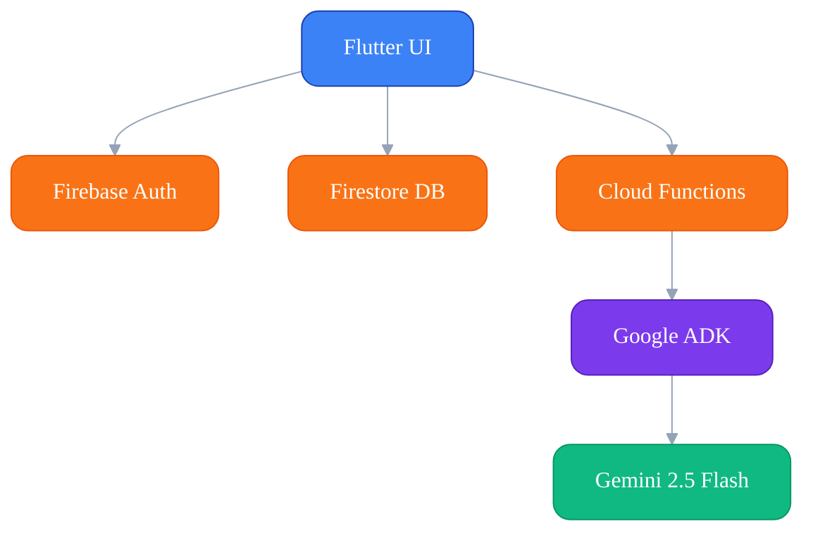

ssyok Finance

Your Hyper-Local AI Financial Companion

Team Hokkien Mee is Red

KITAHACK 2026

SDG 8, TARGET 8.10

DEMO DAY

---
layout: default
transition: fade
---

UNITED NATIONS SUSTAINABLE DEVELOPMENT GOALS

<h1 class="text-center text-5xl font-extrabold mb-2" style="letter-spacing: -0.04em;">
SDG 8: Decent Work
</h1>
<h1 class="text-center text-5xl font-extrabold gradient-text" style="letter-spacing: -0.04em;">
& Economic Growth
</h1>

Strengthen the capacity of domestic financial institutions to encourage and expand access to banking, insurance and financial services for all.

— Target 8.10

Access is not the problem. Understanding is.

---
transition: slide-up
---

# The Grim Reality

53K+

Youths in Debt

aged 30 and below

<a href="https://www.malaymail.com/news/malaysia/2024/10/01/under-30-and-drowning-in-debt-53000-young-adults-in-malaysia-owe-rm19b-as-credit-culture-soars/152230" target="_blank" style="color: var(--sf-slate-soft); font-size: 0.6rem;">AKPK via Malay Mail, Oct 2024</a>

59.1/100

Financial Literacy Score

a failing grade for Malaysia

<a href="https://www.thestar.com.my/business/business-news/2025/03/25/saving-remains-a-struggle-despite-financial-awareness" target="_blank" style="color: var(--sf-slate-soft); font-size: 0.6rem;">BNM FCI Survey 2024 (MYFLIC Index)</a>

RM 1.9B

Youth Debt Total

combined outstanding

<a href="https://www.malaymail.com/news/malaysia/2024/10/01/under-30-and-drowning-in-debt-53000-young-adults-in-malaysia-owe-rm19b-as-credit-culture-soars/152230" target="_blank" style="color: var(--sf-slate-soft); font-size: 0.6rem;">AKPK via Malay Mail, Oct 2024</a>

89%

Have Bank Accounts

access is solved

<a href="https://digitalfinance.worldbank.org/country/malaysia" target="_blank" style="color: var(--sf-slate-soft); font-size: 0.6rem;">World Bank Findex 2024</a>

We gave people bank accounts but never taught them how to use them.

---
layout: two-cols-header
---

# The Gap

Access does not equal understanding

::left::

📱

Generic Apps

✗ Too boring

✗ Manual tracking

✗ Foreign context

🏦

Bank Apps

✗ Too corporate

✗ Intimidating

✗ Selling products

::right::

🤖

ssyok Finance

✓ Education + Action

✓ AI-Powered Guidance

✓ Malaysian Heart

MARKET VACUUM

Raiz Malaysia exited Sept 2024

<a href="https://fintechnews.my/44878/wealthtech-malaysia/raiz-invest-exits-malaysia-after-4-years-to-shift-focus-to-australia/" target="_blank" style="color: var(--sf-slate-soft); font-size: 0.55rem;">Fintech News MY, Jul 2024</a>

Users left stranded — no replacement

---
transition: slide-left
---

# The Spark — A Real Conversation

This is the actual chat that started ssyok Finance

💬 THE CONVERSATION

Real WhatsApp chat — I asked my friend: "How much you spend a month ah?"

📊 THE "SOLUTION" — A SPREADSHEET

Manual Google Sheets — income, expenses, savings, food, transport...

"I wanna do the spreadsheet also" — but what if there's an app for that?

Every category he tracks manually — income, rent, food, transport, savings — is already built into ssyok Finance. <strong>With AI.</strong>

---
transition: fade
---

FIRST PRINCIPLES THINKING

<h1 class="text-center text-4xl font-extrabold mb-2" style="letter-spacing: -0.03em; color: var(--sf-slate);">
What is the first principle of
</h1>
<h1 class="text-center text-4xl font-extrabold gradient-text mb-8" style="letter-spacing: -0.03em;">
growing wealth?
</h1>

📋

Track your money

Know where every ringgit went

✗ Reactive — looks backward

🧭

Plan your money

Know where every ringgit <em>should</em> go

✓ Proactive — looks forward

Tracking tells you what happened. Planning tells you what to do.

— ssyok Finance's design philosophy

That's why ssyok Finance is a <strong style="color: var(--sf-slate);">financial planner</strong>, not a finance tracker.

---
layout: two-cols
transition: view-transition
---

# Introducing ssyok Finance

YOUR VIRTUAL CFP

Certified Financial Planner

RM 300–600 / hour

FREE with ssyok Finance

GEMINI BRAINS, MALAYSIAN HEART

<v-clicks>

- 🧠 AI-powered personalized advice
- 🇲🇾 Hyper-local (Mamak, PTPTN, EPF)
- 📊 Real-time net worth & goal tracking
- 🎯 Actionable plans, not just numbers

</v-clicks>

::right::

KEY DIFFERENTIATOR

Personal Inflation Rate

GENERIC CFP ADVICE

"Plan for 3% inflation"

↓

SSYOK FINANCE

"Your inflation is 5.1% based on your medical spending"

Everyone spends differently. A student's inflation is not a parent's inflation.

---
transition: fade
---

# App Demo

<!-- Dashboard -->

<!-- Replace with:  -->

📊

Dashboard

Net Worth Overview

Assets · Debts · Emergency Fund

<!-- Goals -->

<!-- Replace with:  -->

🎯

Goals

Smart Goal Tracking

Progress · Timeline · AI Tips

<!-- AI Chat -->

<!-- Replace with:  -->

🤖

AI Chat

Gemini AI Advisor

"Your Food &amp; Dining is 35% of income — cut by RM 200/mo and you'll hit your House goal 8 months faster"

---
layout: two-cols
---

# Tech Stack

100% GOOGLE

```mermaid
%%{init: {'theme':'base', 'themeVariables': {'primaryColor':'#10b981','primaryTextColor':'#fff','primaryBorderColor':'#059669','lineColor':'#94a3b8','secondaryColor':'#3b82f6','tertiaryColor':'#7c3aed','fontFamily':'Plus Jakarta Sans'}}}%%
flowchart TB
    A["Flutter UI"] --> B["Firebase Auth"]
    A --> C["Firestore DB"]
    A --> D["Cloud Functions"]
    D --> ADK["Google ADK"]
    ADK --> E["Gemini 2.5 Flash"]

    style A fill:#3b82f6,stroke:#1e40af,color:#fff,rx:12
    style B fill:#f97316,stroke:#ea580c,color:#fff,rx:12
    style C fill:#f97316,stroke:#ea580c,color:#fff,rx:12
    style D fill:#f97316,stroke:#ea580c,color:#fff,rx:12
    style ADK fill:#7c3aed,stroke:#5b21b6,color:#fff,rx:12
    style E fill:#10b981,stroke:#059669,color:#fff,rx:12
```

::right::

Flutter

Cross-platform UI

Firebase Auth

Google Sign-In

Firestore

Real-time data

Cloud Functions

Serverless backend

Google ADK

Agent orchestration

Gemini 2.5 Flash

AI engine

WHY THESE CHOICES?

▸ <strong>Cloud Functions</strong> not App Engine — serverless scales to 0, zero idle cost

▸ <strong>ADK</strong> not LangChain — Google-native, auditable for finance

▸ <strong>Flash</strong> not Pro — lower cost/token, still frontier-class for chat

▸ <strong>Firestore</strong> not SQL — offline-first, per-user security rules

▸ <strong>asia-southeast1</strong> — lowest latency to Malaysian users

---

# AI Quality Evaluation

We use <strong>LLM-as-judge</strong> (G-Eval technique) — Gemini 2.5 Pro evaluates Flash responses on 4 dimensions: Financial Accuracy, Malaysian Context, Actionability, and Safety.

EVALUATION METHODOLOGY

①
<strong style="color: var(--sf-slate);">5 test prompts</strong> — EPF, PTPTN, budget, emergency fund, house deposit

②
Each answered by <strong style="color: var(--sf-slate);">Generic LLM</strong> (no context) vs <strong style="color: var(--sf-slate);">ssyok Finance</strong> (Malaysian system instruction)

③
<strong style="color: var(--sf-slate);">GPT-5</strong> acts as impartial judge — cross-vendor model eliminates self-serving bias entirely

④
Each response scored <strong style="color: var(--sf-slate);">1–5</strong> across all 4 dimensions

OPEN SOURCE EVAL SCRIPT

docs/llm-eval/eval.py

RESULTS — ssyok vs GENERIC (GPT-5 judge, avg of 5 prompts)

+35%

Malaysian Context

3.40 → 4.60 / 5

4.80 / 5

Safety (tied)

Both models responsible

4.00

ssyok Overall

vs Generic 3.90 / 5

GPT-5

Cross-vendor judge

Zero self-serving bias

---

# User Feedback & Iteration

We tested with real users across 6 different Android devices. Here's what the data showed.

<!-- Column 1: Quantified stats -->

SURVEY SNAPSHOT

6

Testers, 6 Devices

4.2/5

Avg Onboarding Clarity

0

Crashes Reported

"Amazing and structured app for beginners and professionals"

<!-- Column 2: Real feedback screenshot -->

SURVEY RESULTS

<!-- Column 3: Feedback → Iteration -->

FEEDBACK → ITERATION

Requested

Monthly cash flow & budgeting

→ Added to Q3 roadmap

Requested

Personalisation features

→ AI persona in v2 plan

Validated

Dashboard as hero screen

→ 5/6 users loved it ✓

---

# Business Model & Future Roadmap

FREE TIER

Ad-Supported via Google AdMob

✅ Financial dashboard

✅ Goals & debt tracking

✅ Standard calculators

✅ Limited Gemini chat (5/mo)

FREE

SSYOK+ AI

Premium Subscription

✅ Everything in Free

✅ <strong class="gradient-text">100 AI responses/mo</strong>

✅ Smart spending audits

✅ Auto debt snowball

🚫 <strong style="color: var(--sf-slate);">No ads</strong>

RM 4.90/mo

ROADMAP

Post-Hackathon Development

Q3 2026

Google Play + budgeting

Q4 2026

Open banking APIs

2027

Insurance + EPF optimizer

Vision

Full platform for SEA

Self-sustaining model — AdMob + Google Play subscriptions from day one

---

# Go-To-Market & SDG Impact

MARKET OPPORTUNITY

TAM

25M

Smartphone users

SAM

10M

Gen Z & Millennials

SOM Y1

100K

Fresh Grads & Youth

SUCCESS METRICS

📊 <strong>Month 3:</strong> 1,000 active users

📊 <strong>Month 6:</strong> 10,000 users + 500 paid

📊 <strong>Year 1:</strong> 100K users + SDG impact report

GO-TO-MARKET

🎓

<strong style="color: var(--sf-slate);">University Partnerships</strong> — Finance clubs, workshops

📱

<strong style="color: var(--sf-slate);">TikTok Content</strong> — "Financial Mistakes 101"

👥

<strong style="color: var(--sf-slate);">Campus Ambassadors</strong> — Peer-to-peer growth

SDG 8.10 DIRECT ALIGNMENT

✓ "For ALL" — Free tier, zero barrier

✓ "Banking" — Savings + emergency fund

✓ "Insurance" — Coverage tracker

✓ "Financial services" — AI explains all

---
layout: cover
transition: fade
---

Team Hokkien Mee is Red

Building the future of financial literacy for Malaysia

👨‍💻

Sim Sze Yu

CEO & Lead Engineer

🤖

Claude

CTO & Architecture

✨

Gemini

AI Product Lead

Help us help Malaysia save — one ringgit at a time

github.com/szeyu/open-ssyok-finance

KITAHACK 2026

SDG 8.10

FINANCIAL ACCESS FOR ALL

