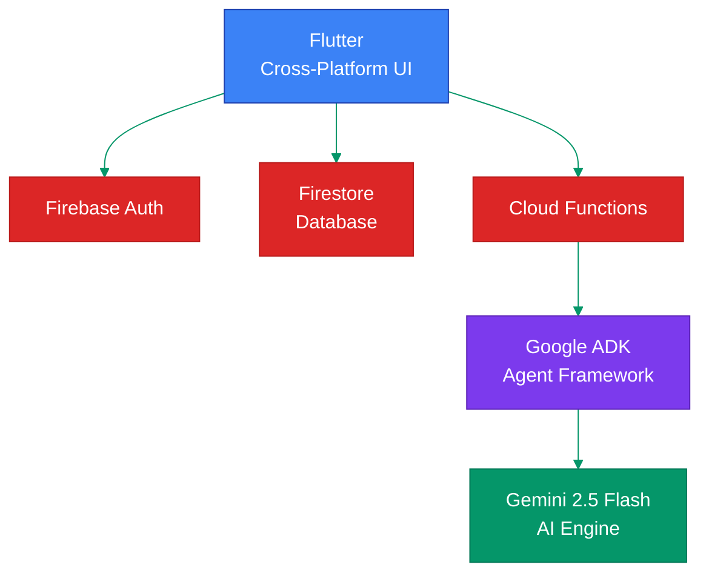

💰 ssyok Finance

Your Hyper-Local AI Financial Companion

Team Hokkien Mee is Red

🎯 KitaHack 2026 • SDG 8.10

---
layout: statement
transition: fade
---

# 🎯 **SDG 8: Decent Work & Economic Growth**

## Target 8.10

"Strengthen the capacity of domestic financial institutions to encourage and expand access to banking, insurance and financial services for all."

But what does "access" mean if people can't use it?

---
layout: fact
transition: slide-up
---

# 😰 **The Grim Reality**

53,000+

Youths in Debt (aged ≤30)

AKPK, March 2024

19%

Meet Minimum Financial Literacy Score

OECD/INFE 2023 International Survey

RM 1.9B

Youth Debt Total

AKPK, March 2024

97%

Have Active Bank Accounts

BNM Financial Inclusion 2024

"We're raising a generation that knows TikTok but not how to save."

---
layout: two-cols-header
---

# 🔍 **The Gap: Access ≠ Understanding**

::left::

📱

Generic Apps

✗ Too boring

✗ Manual tracking

✗ Foreign context

🏦

Bank Apps

✗ Too corporate

✗ Intimidating

✗ Selling products

::right::

🤖

ssyok Finance

✓ Education + Action

✓ AI-Powered Guidance

✓ Malaysian Heart

Market Vacuum

Raiz Malaysia exited Sept 2024

Users left stranded, no replacement

---
layout: two-cols
transition: view-transition
---

# 💡 **Introducing ssyok Finance**

## Your Virtual CFP

Certified Financial Planner 
costs RM 200-500/hour

ssyok Finance is FREE

### Gemini Brains, Malaysian Heart

<v-clicks>

- 🧠 AI-powered personalized advice
- 🇲🇾 Hyper-local (Mamak, PTPTN, EPF)
- 📊 Real-time net worth & goals
- 🎯 Actionable plans, not just numbers

</v-clicks>

::right::

## 🌟 **Key Differentiator**

### Personal Inflation Rate

Generic CFP Advice

"Plan for 3% inflation"

↓

ssyok Finance

"Your inflation is 5.1% based on your medical spending"

💡 Everyone spends differently. A student's inflation ≠ a parent's inflation.

---
layout: default
transition: fade
---

# 🎬 **App Demo**

<!-- SCREENSHOT PLACEHOLDER 1: Dashboard -->

📊

[ SCREENSHOT ]

Dashboard Screen

Net Worth Overview

Assets · Debts · Emergency Fund

<!-- SCREENSHOT PLACEHOLDER 2: Goals -->

🎯

[ SCREENSHOT ]

Goals Screen

Smart Goal Tracking

Progress · Timeline · AI Tips

<!-- SCREENSHOT PLACEHOLDER 3: AI Chat -->

🤖

[ SCREENSHOT ]

AI Chat Screen

Gemini AI Advisor

"Boss, your Kopi ais is cutting into your House fund 🏠"

---
layout: two-cols
---

# 🛠️ **Tech Stack: 100% Google**

```mermaid
%%{init: {'theme':'base', 'themeVariables': {'primaryColor':'#065f46','primaryTextColor':'#000','primaryBorderColor':'#047857','lineColor':'#059669','secondaryColor':'#1e40af','secondaryTextColor':'#000','secondaryBorderColor':'#2563eb','tertiaryColor':'#dc2626','tertiaryTextColor':'#fff','tertiaryBorderColor':'#b91c1c'}}}%%
flowchart TB
    A[Flutter<br/>Cross-Platform UI] --> B[Firebase Auth]
    A --> C[Firestore<br/>Database]
    A --> D[Cloud Functions]
    D --> ADK[Google ADK<br/>Agent Framework]
    ADK --> E[Gemini 2.5 Flash<br/>AI Engine]
    
    style A fill:#3b82f6,stroke:#1e40af,color:#fff
    style B fill:#dc2626,stroke:#b91c1c,color:#fff
    style C fill:#dc2626,stroke:#b91c1c,color:#fff
    style D fill:#dc2626,stroke:#b91c1c,color:#fff
    style ADK fill:#7c3aed,stroke:#5b21b6,color:#fff
    style E fill:#059669,stroke:#047857,color:#fff
```

::right::

| Technology | Role |
|------------|-------|
| **Flutter** | Cross-platform UI |
| **Firebase Auth** | Secure Google Sign-In |
| **Firestore** | Real-time data sync |
| **Cloud Functions** | Serverless backend |
| **Google ADK** | Agent orchestration |
| **Gemini 2.5 Flash** | AI reasoning engine |

Perfect KitaHack Alignment

Full Google AI ecosystem — no third-party AI

⚡ Key Challenge Solved

Prompt engineering with Malaysian context (EPF, PTPTN, RM-denominated advice)

---
layout: default
---

# 👥 **User Feedback & Iteration**

We didn't just build it. We tested it with real users.

### 📋 Testing Process

1.
Recruited <strong>university students</strong> (Gen Z target users)

2.
Tested on <strong>real devices</strong> — Samsung, Realme, Poco, Redmi

3.
Collected structured feedback via <strong>survey forms</strong>

### 🔄 What Users Told Us

<v-clicks>

❤️ #1 Feature: Dashboard & Net Worth Graph — loved across all testers

⭐ Also loved: Calculators (FIRE, Inflation) & Privacy / Offline Mode

📢 Top Request: Monthly cash flow & budgeting — building it next

💬 User Quote: "Amazing and structured app for beginners and professionals"

</v-clicks>

---
layout: default
---

# 💰 **Business Model: Friendly Freemium**

Lower barriers, monetize power users

### 🆓 **Free Tier**

(Ad-Supported)

✅ Financial dashboard & tracking

✅ Goals, debts, expenses management

✅ Standard calculators (FIRE, Compound)

✅ Limited Gemini chat (10/month)

📱 Banner ads (Google AdMob)

FREE

### ⭐ **ssyok+ AI**

(Premium)

✅ Everything in Free

✅ Unlimited Gemini chat

✅ Smart spending audits

✅ Automated debt snowball

🚫 No ads

RM 4.90/month

💡 Self-sustaining model — not just a hackathon project

---
layout: default
---

# 🚀 **Go-To-Market & Impact**

### 📈 Market Opportunity

TAM

25M

Smartphone users

SAM

10M

Gen Z & Millennials

SOM Y1

100K

Fresh Grads & Youth

### 🎯 Success Metrics

📊 <strong>Month 3:</strong> 1,000 active users

📊 <strong>Month 6:</strong> 10,000 users + 500 paid

📊 <strong>Year 1:</strong> 100K users + impact report

### 🚀 How We Get There

🎓

<strong>University Partnerships</strong> — Finance clubs, workshops

📱

<strong>TikTok Content</strong> — "Financial Mistakes 101"

👥

<strong>Campus Ambassadors</strong> — Peer-to-peer growth

### 🌍 SDG 8.10 Alignment

✓ "For ALL" → Free tier, no barrier

✓ "Banking" → Savings + emergency fund

✓ "Insurance" → Coverage tracker

✓ "Financial services" → AI explains all

---
layout: end
transition: fade
---

# 🍜 **Team Hokkien Mee is Red**

Building the future of financial literacy for Malaysia

👨‍💻

Sim Sze Yu

CEO & Lead Engineer

🤖

Claude

CTO & Architecture

✨

Gemini

AI Product Lead

📲 Help us help Malaysia save — one Kopi ais at a time ☕

github.com/szeyu/open-ssyok-finance

<!-- PLAY STORE PLACEHOLDER -->

▶️

Coming Soon on

Google Play

🎯 KitaHack 2026 • SDG 8.10 • Financial Access for All

