💰 ssyok Finance

Your Hyper-Local AI Financial Companion

Team Hokkien Mee is Red

🎯 KitaHack 2026 • SDG 8.10

---
layout: statement
transition: fade
---

# 🎯 **SDG 8: Decent Work & Economic Growth**

## Target 8.10

"Strengthen the capacity of domestic financial institutions to encourage and expand access to banking, insurance and financial services for all."

But what does "access" mean if people can't use it?

---
layout: fact
transition: slide-up
---

# 😰 **The Grim Reality**

53,000

Youths Bankrupt

36%

Financial Literacy

RM 1.9B

Youth Debt

96%

Have Bank Accounts

"We're raising a generation that knows TikTok but not how to save."

---
layout: two-cols-header
---

# 🔍 **The Gap: Access ≠ Understanding**

::left::

📱

Generic Apps

✗ Too boring

✗ Manual tracking

✗ Foreign context

🏦

Bank Apps

✗ Too corporate

✗ Intimidating

✗ Selling products

::right::

🤖

ssyok Finance

✓ Education + Action

✓ AI-Powered Guidance

✓ Malaysian Heart

Market Vacuum

Raiz Malaysia exited Sept 2024

Users left stranded

---
layout: two-cols
transition: view-transition
---

# 💡 **Introducing ssyok Finance**

## Your Virtual CFP

Certified Financial Planner 
costs RM 200-500/hour

ssyok Finance is FREE

### Gemini Brains, Malaysian Heart

<v-clicks>

- 🧠 AI-powered personalized advice
- 🇲🇾 Hyper-local context (Mamak, Kopi ais)
- 📊 Real-time financial analysis
- 🎯 Actionable goal planning

</v-clicks>

::right::

## 🌟 **Key Differentiator**

### Personal Inflation Rate

Generic CFP Advice

"Plan for 3% inflation"

↓

ssyok Finance

"Your inflation is 5.1% based on your medical spending"

💡 Everyone spends differently. A student's inflation ≠ a parent's inflation.

---
layout: center
transition: fade
---

# 🎬 **Live Demo Journey**

```mermaid
%%{init: {'theme':'base', 'themeVariables': {'primaryColor':'#a7f3d0','primaryTextColor':'#064e3b','primaryBorderColor':'#10b981','lineColor':'#059669','secondaryColor':'#bfdbfe','secondaryTextColor':'#1e3a8a','secondaryBorderColor':'#3b82f6','tertiaryColor':'#fde68a','tertiaryTextColor':'#78350f','tertiaryBorderColor':'#f59e0b','noteBkgColor':'#fef3c7','noteTextColor':'#000','noteBorderColor':'#f59e0b'}}}%%
sequenceDiagram
    participant U as 👤 User
    participant A as 📱 App
    participant G as 🤖 Gemini AI
    
    U->>A: Opens Dashboard
    A->>U: Shows Net Worth: RM 45,000
    U->>A: Navigates to Goals
    A->>U: House Deposit: RM 50K needed
    U->>G: "How do I reach my goal faster?"
    G->>A: Analyzes spending patterns
    A->>U: "Boss, your Kopi ais is cutting<br/>into your House fund 🏠"
    A->>U: "Reduce dining by RM 200/mo<br/>→ Reach goal 8 months earlier"
```

This is what makes us different: 
Not just tracking — Understanding + Action

---
layout: two-cols
---

# 🛠️ **Tech Stack: 100% Google**

::right::

| Technology | Why We Use It |
|------------|---------------|
| **Flutter** | Beautiful cross-platform UI |
| **Firebase Auth** | Secure OAuth authentication |
| **Firestore** | Real-time data sync |
| **Cloud Functions** | Scalable serverless backend |
| **Google ADK** | Agent orchestration & streaming |
| **Gemini 2.5 Flash** | Context-aware AI reasoning |
| **Google Play** | Distribution ready |

Perfect KitaHack Alignment

Leveraging the full Google AI ecosystem

---
layout: default
---

# 💰 **Business Model: Friendly Freemium**

Lower barriers, monetize power users

### 🆓 **Free Tier**

(Ad-Supported)

✅ Manual expense tracking

✅ Basic charts & calculations

✅ Standard financial tools

✅ Limited Gemini chat (10/month)

📱 Banner ads (Google AdMob)

FREE

### ⭐ **ssyok+ AI**

(Premium)

✅ Everything in Free

✅ Unlimited Gemini chat

✅ Smart spending audits

✅ Automated debt snowball

🚫 No ads

RM 4.90/month

💡 Self-sustaining model — Not just a hackathon project

---
layout: default
---

# 🚀 **Go-To-Market Strategy**

<v-click>

🎓

University Partnerships

• Finance clubs

• Student workshops

• Campus ambassadors

</v-click>

<v-click>

📱

TikTok Content

• Finfluencer-style videos

• "Financial Mistakes 101"

• Viral money tips

</v-click>

<v-click>

👥

Campus Ambassadors

• Student advocates

• Peer-to-peer growth

• Word of mouth

</v-click>

<v-click>

TAM

25M

Adults with smartphones

SAM

10M

Gen Z & Millennials

SOM (Year 1)

200K

"Raiz Refugees"

</v-click>

---
layout: statement
transition: view-transition
---

# 🌍 **The Impact: SDG 8.10**

We don't just track wealth. We build resilience.

### How We Deliver on Target 8.10

✓ "Expand access" → Free tier, no barrier

✓ "For ALL" → Youth-friendly, not intimidating

✓ "Banking" → Savings + emergency fund

✓ "Insurance" → Coverage tracker

✓ "Financial services" → AI guidance

### Real Validation

12

Active Beta Testers

"Most hackathon projects are vaporware. We have real users testing right now."

✅ Play Store Live

Collecting feedback

---
layout: end
transition: fade
---

# 🍜 **Team Hokkien Mee is Red**

Building the future of financial literacy for Malaysia

## 📲 **The Ask**

Download the Beta. Help us help Malaysia save.

📱

QR Code / GitHub Link

github.com/ssyok/finance

🎯 KitaHack 2026 • SDG 8.10 • Financial Access for All

